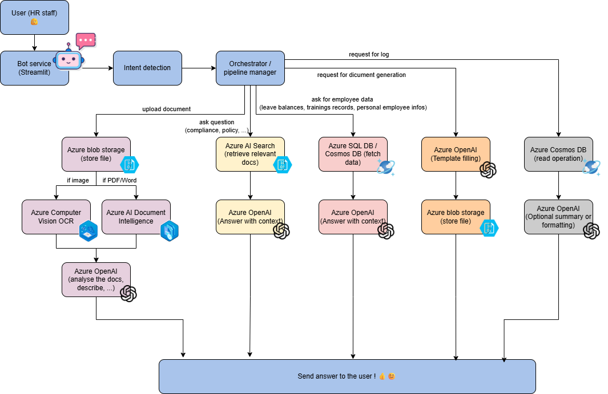

# NOLAN (No One Likes Administrative Nonsense)

1. Intent 

| Intent Category          | Intent Name (identified, can be more) | Description                                                    | Azure Foundry Resources                                                                                                                 |
| ------------------------ | ------------------------------------- | -------------------------------------------------------------- | --------------------------------------------------------------------------------------------------------------------------------------- |
| **Document Analysis**    | Analyze Contract                      | Upload and analyze employment contracts.                       | - **Azure Blob Storage** - **Azure AI Document Intelligence** - **Azure AI Search** - **Azure OpenAI (GPT-4o mini)**           |
|                          | Analyze Payslip                       | Upload and analyze payroll documents.                          | - **Azure Blob Storage** - **Azure AI Document Intelligence** - **Azure AI Search** - **Azure OpenAI (GPT-4o mini)**           |
|                          | Analyze Certificate                   | Upload doctor notes, certificates for processing.              | - **Azure Blob Storage** - **Azure Computer Vision OCR** - **Azure AI Document Intelligence** - **Azure OpenAI (GPT-4o mini)** |
| **Policy Search**        | Search Internal HR Policies           | Search policies, legal documents, internal agreements.         | - **Azure AI Search** - **Azure OpenAI (GPT-4o mini)** - **Azure OpenAI Embeddings** - **Azure Blob Storage**                  |
|                          | Search Collective Agreements          | Analyze legal frameworks like Syntec.                          | - **Azure AI Search** - **Azure OpenAI (GPT-4o mini)** - **Azure OpenAI Embeddings** - **Azure Blob Storage**                  |
| **Employee Data Access** | Retrieve Employee Information         | Access specific employee files.                                | - **Azure Cosmos DB** - **Azure SQL Database** - **Azure Functions**                                                              |
|                          | Verify Leave Balances                 | Check current leave balances for employees.                    | - **Azure SQL Database** - **Azure Functions**                                                                                       |
|                          | Review Training Records               | Retrieve employee training history.                            | - **Azure SQL Database** - **Azure Functions**                                                                                       |
| **Compliance Support**   | Verify Legal Compliance               | Check if certain HR actions comply with collective agreements. | - **Azure AI Search** - **Azure OpenAI (GPT-4o mini)** - **Azure Blob Storage** - **Azure OpenAI Embeddings**                  |
| **Process Automation**   | Generate HR Documents                 | Automatically fill HR templates.                               | - **Azure Functions** - **Azure Logic Apps** - **Azure OpenAI (GPT-4o mini)** - **Azure Blob Storage (Templates)**             |
|                          | Create Employment Certificates        | Generate standard HR documents for employees.                  | - **Azure Functions** - **Azure Logic Apps** - **Azure OpenAI (GPT-4o mini)** - **Azure Blob Storage (Templates)**             |
| **Admin Functions**      | Log Review                            | Review previous conversations and actions.                     | - **Azure Cosmos DB** - **Azure Log Analytics** - **Azure Monitor**                                                               |
|                          | Data Correction                       | Correct inaccurate records.                                    | - **Azure SQL Database** - **Azure Cosmos DB** - **Azure Functions**                                                              |

2. Architecture

