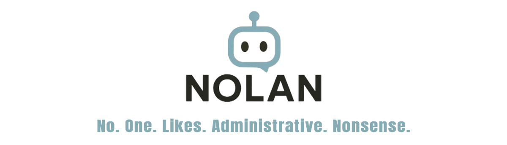

# NOLAN — No One Likes Administrative Nonsense



Because no one likes administrative nonsense, NOLAN is your AI-powered HR assistant that automates document analysis, HR policy retrieval, employee data access and compliance checks using Azure's AI and cloud services.

---

## 🔧 Setup & Launch Instructions

### 1. Environment Setup

```bash
python -m venv venv
source venv/bin/activate      # or .\venv\Scripts\activate on Windows
pip install -r requirements.txt
```

### 2. Run the backend (FastAPI)

```bash
uvicorn main:app --reload
```

> Launches the FastAPI orchestrator for intent routing and API handling on `http://127.0.0.1:8000`  
> You can test all endpoints independently via the automatically generated Swagger UI at `http://127.0.0.1:8000/docs`.

### 3. Run the frontend (Streamlit)

```bash
streamlit run .streamlit/app.py
```

> Opens the chatbot UI for HR interaction.

---

## 🧠 Supported Functionalities

| Intent Category          | Intent Name                        | Description                                                  | Azure Services Used                                                                                 |
|--------------------------|------------------------------------|--------------------------------------------------------------|------------------------------------------------------------------------------------------------------|
| **Document Analysis**    | Analyze Contract                   | Upload and analyze employment contracts                      | Blob Storage, AI Document Intelligence, AI Search, OpenAI GPT-4o mini                                |
|                          | Analyze Payslip                    | Payroll document parsing                                     | Blob Storage, AI Document Intelligence, AI Search, OpenAI GPT-4o mini                                |
|                          | Analyze Certificate                | Doctor notes / justification processing                      | Blob Storage, Computer Vision OCR, AI Document Intelligence, OpenAI GPT-4o mini                      |
| **Policy Search**        | Search Internal HR Policies        | Retrieve HR guidelines, rules                                | AI Search, Blob Storage, OpenAI, Embeddings                                                          |
|                          | Search Collective Agreements       | Query and explain legal obligations                          | AI Search, Blob Storage, OpenAI, Embeddings                                                          |
| **Employee Data Access** | Retrieve Employee Information      | Access individual HR records                                 | SQL DB, Cosmos DB, Azure Functions                                                                   |
|                          | Verify Leave Balances              | Real-time vacation tracking                                  | SQL DB, Azure Functions                                                                              |
|                          | Review Training Records            | Employee learning history                                    | SQL DB, Azure Functions                                                                              |
| **Compliance Support**   | Verify Legal Compliance            | Validate policy/legal conformity                             | AI Search, OpenAI, Blob Storage, Embeddings                                                          |
| **Process Automation**   | Generate HR Documents              | Fill HR templates dynamically                                | Logic Apps, Blob Storage, OpenAI, Functions                                                          |
|                          | Create Employment Certificates     | Generate legal/formal HR documents                           | Logic Apps, OpenAI, Blob Storage                                                                     |
| **Admin Functions**      | Log Review                         | Retrieve past conversations or logs                          | Cosmos DB, Azure Monitor, Log Analytics                                                              |
|                          | Data Correction                    | Edit/update HR records                                       | SQL DB, Cosmos DB, Functions                                                                         |

---

## 🏗️ Azure-based Architecture

The NOLAN system is built entirely on Azure infrastructure, combining storage, AI, and orchestration services. Below is an overview of how components interact:


**Main components include:**

- **Azure Blob Storage**: Stores documents, templates, embeddings
- **Azure OpenAI**: Handles all completions, answers, summarization and generation via GPT-4o mini
- **Azure AI Search**: Retrieves relevant documents from indexed HR corpuses
- **Azure SQL Database**: Stores structured employee data
- **Azure Cosmos DB**: Logs chat history and operations
- **Azure Logic Apps / Functions**: Automates document workflows and intent execution
- **Azure AI Document Intelligence & Computer Vision**: Parses and OCRs uploaded HR files

---

## 🎯 Objective

> The goal is to offer HR staff a seamless AI assistant that can interpret, search, generate and verify, across all HR documentation and employee datasets, with minimal manual overhead.

---

## 📤 Output

All answers are routed back via the Streamlit frontend after being processed through the orchestrator and appropriate Azure service pipelines.

The backend (FastAPI) can also be queried independently using tools like Postman or cURL via `http://localhost:8000/docs` for testing and integration purposes.
